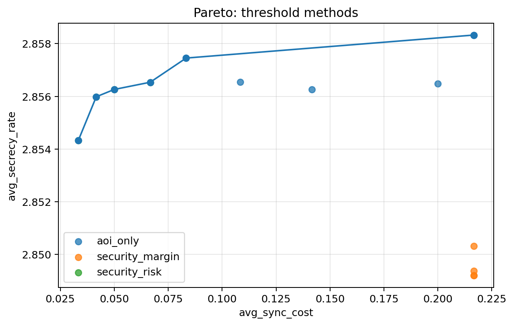
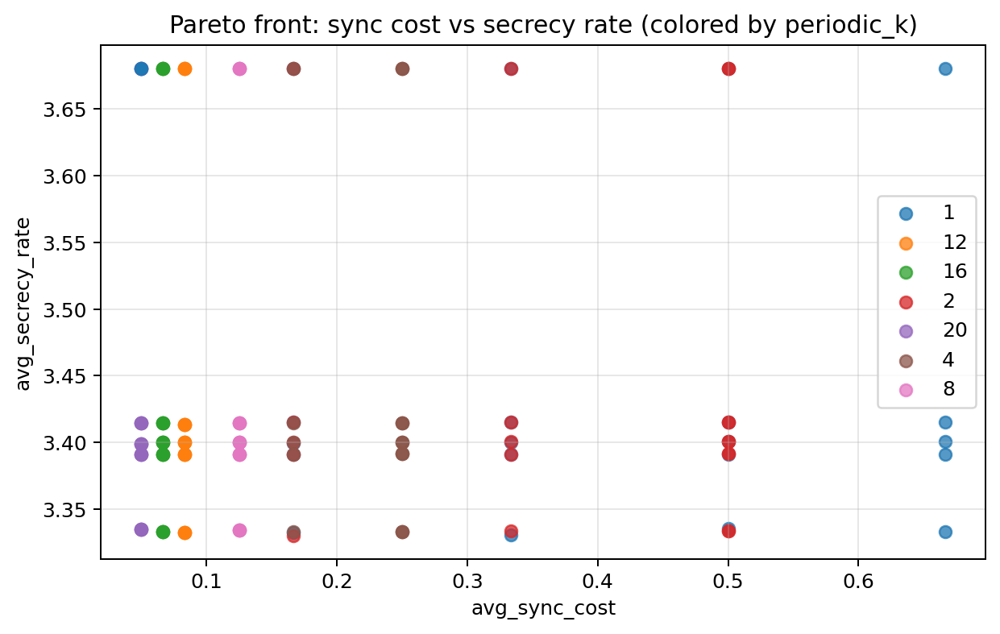
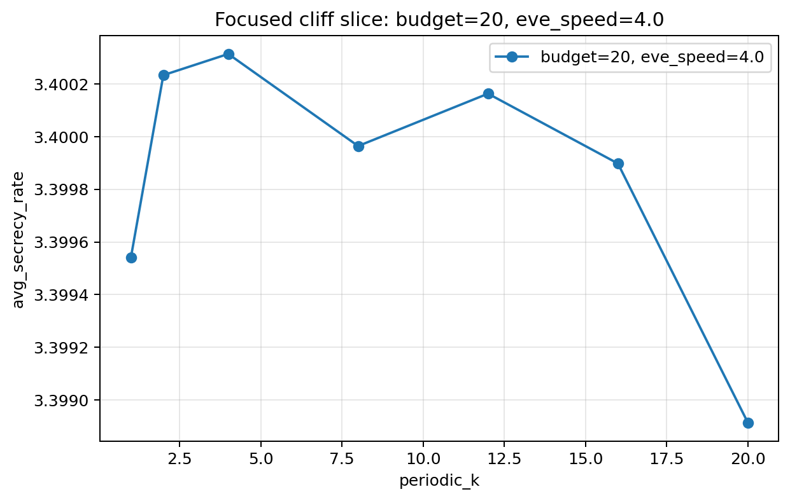

# 项目论文投稿就绪度评估（2026-04-14）

## 1. 评估结论

### 1.1 一句话结论

当前项目已经具备“论文雏形”和“较完整的实验主线”，但**还不建议立刻投稿**。  
如果目标是偏应用/系统导向的四区期刊，在补完一轮多 seed 主表、消融实验和 runtime 说明后，投稿把握会明显提升。

### 1.2 为什么我不建议现在直接投

目前最主要的短板不是“没有结果”，而是“结果还不够厚”：

1. 最终主表虽然已经有多场景、多方法和置信区间，但当前归档版本只覆盖 `3` 个验证 seed，证据厚度仍偏薄。
2. `rollout_joint` 在 `paper_base`、`paper_hard` 中有竞争力，但在 `scenario_stress` 中并没有形成稳定统治。
3. 主方法 runtime 仍明显偏高，约为规则法的 `25x-27x`，如果没有额外解释或消融，审稿人容易质疑实用性。
4. 证书模型的“覆盖率”很强，但“松弛量偏大”，更适合写成经验保守 bound，而不是紧致理论 bound。
5. 当前全部证据都来自纯仿真，没有真实轨迹、公开数据集或半实物验证，这会限制论文说服力上限。

### 1.3 更准确的判断

更准确的说法是：

> 这个项目已经接近四区应用类论文的投稿门槛，但还没有达到“现在就投也很稳”的状态。  
> 只要再补一轮主表加厚和方法消融，它就会从“可写”进入“可投”。

---

## 2. 我本次遍历项目时采用的证据口径

我主要依据以下仓库内结果做判断：

1. 最终主表归档：[final_main_tables.md](./final_main_tables.md)
2. holdout 证书评估：[holdout_tuned_analysis.md](./holdout_tuned_analysis.md)
3. 当前阶段评估：[current_stage_assessment.md](./current_stage_assessment.md)
4. 基础机制实验：
   - [results_round1_8/threshold/threshold_summary_agg.csv](../results_round1_8/threshold/threshold_summary_agg.csv)
   - [results_round1_8_coupling_fixed/coupling_summary_agg.csv](../results_round1_8_coupling_fixed/coupling_summary_agg.csv)
5. 方法与实验脚本：
   - [policies/rollout_joint.py](../policies/rollout_joint.py)
   - [experiments/fit_certificate_holdout.py](../experiments/fit_certificate_holdout.py)
   - [experiments/run_baselines.py](../experiments/run_baselines.py)
   - [experiments/run_threshold.py](../experiments/run_threshold.py)
   - [experiments/run_coupling.py](../experiments/run_coupling.py)

---

## 3. 当前实验结果汇总

### 3.1 证书模型泛化结果

holdout 证书线是当前项目最强的部分之一。根据 [holdout_tuned_analysis.md](./holdout_tuned_analysis.md) 中归档结果：

| 划分 | 场景 | 覆盖率 | 上界减损失均值 | P90 上界减损失 | 平均真实损失 |
| --- | --- | ---: | ---: | ---: | ---: |
| train | all | 0.9994 | 0.1222 | 0.2581 | 0.0051 |
| validation | all | 0.9952 | 0.6999 | 2.3882 | 0.0102 |
| validation | paper_base | 1.0000 | 0.5084 | 1.7096 | 0.0105 |
| validation | paper_hard | 0.9964 | 0.7685 | 2.6324 | 0.0103 |
| validation | scenario_stress | 0.9906 | 0.7834 | 2.6761 | 0.0099 |

解释：

1. 覆盖率很高，说明证书不是单纯记忆训练轨迹。
2. 但 `upper_minus_loss` 明显偏大，说明证书偏保守。
3. 这条线适合写成“经验校准的保守 secrecy-loss certificate”，不适合写成“紧致理论上界”。

### 3.2 当前最接近论文主表的结果

以下表格来自 [final_main_tables.md](./final_main_tables.md)，是目前仓库里最成熟、最像投稿主表的一组结果。

#### paper_base

| 方法 | 平均保密速率 ± CI | Outage ± CI | 平均同步成本 | 覆盖率 | 每时隙运行时间 ms ± CI |
| --- | --- | --- | ---: | ---: | --- |
| rollout_joint | 2.7356 ± 0.0255 | 0.1583 ± 0.0499 | 0.0083 | 1.0000 | 684.95 ± 11.57 |
| oracle_sync | 2.7292 ± 0.0247 | 0.1556 ± 0.0446 | 0.0000 | 1.0000 | 617.45 ± 20.63 |
| security_margin | 2.7110 ± 0.0129 | 0.1611 ± 0.0465 | 0.2333 | 1.0000 | 25.29 ± 0.59 |
| security_risk | 2.7075 ± 0.0185 | 0.1694 ± 0.0628 | 0.1028 | 1.0000 | 25.98 ± 2.13 |
| periodic | 2.7034 ± 0.0212 | 0.1389 ± 0.0054 | 0.1500 | 1.0000 | 25.61 ± 1.36 |

#### paper_hard

| 方法 | 平均保密速率 ± CI | Outage ± CI | 平均同步成本 | 覆盖率 | 每时隙运行时间 ms ± CI |
| --- | --- | --- | ---: | ---: | --- |
| rollout_joint | 2.5762 ± 0.0247 | 0.5738 ± 0.0415 | 0.0143 | 0.9976 | 666.01 ± 4.98 |
| oracle_sync | 2.5755 ± 0.0307 | 0.5738 ± 0.0364 | 0.0000 | 0.9976 | 619.44 ± 25.31 |
| security_margin | 2.5709 ± 0.0255 | 0.5714 ± 0.0242 | 0.1571 | 1.0000 | 25.03 ± 1.67 |
| security_risk | 2.5695 ± 0.0215 | 0.5690 ± 0.0306 | 0.0881 | 0.9976 | 24.77 ± 0.52 |
| periodic | 2.5666 ± 0.0226 | 0.5738 ± 0.0047 | 0.1571 | 1.0000 | 24.82 ± 1.82 |

#### scenario_stress

| 方法 | 平均保密速率 ± CI | Outage ± CI | 平均同步成本 | 覆盖率 | 每时隙运行时间 ms ± CI |
| --- | --- | --- | ---: | ---: | --- |
| periodic | 2.4658 ± 0.0237 | 0.4917 ± 0.0147 | 0.1188 | 0.9958 | 25.09 ± 1.13 |
| security_margin | 2.4657 ± 0.0260 | 0.4729 ± 0.0147 | 0.1188 | 1.0000 | 24.42 ± 0.93 |
| rollout_joint | 2.4629 ± 0.0255 | 0.4854 ± 0.0108 | 0.0271 | 0.9958 | 683.44 ± 21.55 |
| oracle_sync | 2.4618 ± 0.0297 | 0.4937 ± 0.0212 | 0.0000 | 0.9979 | 619.30 ± 26.51 |
| security_risk | 2.4563 ± 0.0313 | 0.4958 ± 0.0248 | 0.0813 | 0.9958 | 24.78 ± 2.39 |

### 3.3 这些主表说明了什么

从主表能稳妥支持的结论有四点：

1. `rollout_joint` 在 `paper_base` 和 `paper_hard` 的 secrecy 指标上最强或近似最强。
2. `rollout_joint` 的同步成本极低，说明联合前瞻控制确实在减少同步动作。
3. `scenario_stress` 中规则法仍然很有竞争力，尤其 `security_margin` 的 outage 更优。
4. `rollout_joint` 的 runtime 代价仍然很大，这是论文里必须正面讨论的系统权衡。

### 3.4 机制实验图

这些图还不能直接当“最终主图”，但它们很好地支撑了论文中的机制分析部分：

#### 阈值扫描 Pareto 图

来源： [results_round1_8/threshold/threshold_pareto.png](../results_round1_8/threshold/threshold_pareto.png)

#### 同步成本与 secrecy Pareto 图

来源： [results_round1_8_coupling_fixed/pareto_sync_vs_secrecy.png](../results_round1_8_coupling_fixed/pareto_sync_vs_secrecy.png)

#### cliff effect 聚焦图

来源： [results_round1_8_coupling_fixed/cliff_effect_focus.png](../results_round1_8_coupling_fixed/cliff_effect_focus.png)

这些图至少说明两件事：

1. 项目不是“只跑了一个主表”，而是已经有机制实验支撑同步-质量-保密率之间的耦合叙事。
2. 当前方法设计和场景设置确实能产生可解释的 trade-off，而不是纯随机波动。

---

## 4. 是否具备发论文条件

## 4.1 已经具备的条件

### A. 问题定义是完整的

当前研究问题并不散，已经收敛成一个明确主题：

1. 数字孪生状态老化与预测误差
2. 预算受限同步
3. 保密通信与 UAV 协同控制
4. 性能、同步成本、runtime 三者权衡

这已经是可以写论文的问题定义，而不再只是“做了几个脚本”。

### B. 实验框架是完整的

项目已有：

1. baseline 对比
2. threshold 扫描
3. coupling 机制实验
4. holdout 证书拟合与验证
5. 多场景主表

从论文结构角度看，实验章节骨架已经够用了。

### C. 主方法叙事可以成立

[rollout_joint.py](../policies/rollout_joint.py) 里的轻量化控制器已经比较像“可发表方法”：

1. 根节点保留高分候选
2. 未来步骤使用贪心 tail rollout
3. 可以解释为轻量化近似 MPC / look-ahead controller

这比早期那种“很重但不好讲”的搜索策略更适合论文表达。

### D. 证书线是当前最硬的贡献点

[fit_certificate_holdout.py](../experiments/fit_certificate_holdout.py) 已经把证书从启发式规则推进到了“有训练/验证划分的经验校准模型”。  
如果论文主叙事写成：

`数字孪生不确定性校准 + 安全感知同步控制 + 性能/runtime 权衡`

这个方向是成立的。

## 4.2 还不具备的条件

### A. 证据厚度不够

这是最核心的原因。

当前最成熟主表只有 `3` 个验证 seed。对低区期刊来说不算致命，但仍偏薄。  
如果审稿人追问稳定性、显著性和泛化，你现在的证据会显得不够厚。

### B. 方法优势还不够“硬”

你现在更适合宣称：

`rollout_joint 在多数场景下有竞争力，并显著降低同步频率，但需要支付更高 runtime。`

而不适合宣称：

`rollout_joint 在所有场景、所有指标上都明显优于所有基线。`

原因就在 `scenario_stress`：规则法仍然顶得住。

### C. 缺少消融实验

现在还不能清楚回答：

1. 性能增益到底来自 rollout，还是来自评分函数中的风险项/证书项？
2. 轻量化后损失了什么、保留了什么？
3. 如果去掉证书项、去掉 pending sync 惩罚、去掉 tail rollout，会发生什么？

没有这部分，方法贡献容易被认为“不够拆解”。

### D. 缺少更强的外部有效性

全部结果都来自本地纯仿真框架。  
对四区期刊来说可以接受，但至少还应该补一个更强的“外部合理性”支撑，比如：

1. 更广范围场景参数随机化
2. 真实轨迹驱动的 Eve/UAV 运动
3. 半实物或公开数据驱动的 sanity check

---

## 5. 下一步实验方案

如果我们要把它推进到“可以投稿”的状态，我建议按下面顺序补实验。

### 5.1 第一优先级：把最终主表加厚

目标：把现有 `3` 个验证 seed 扩展到至少 `10` 个，最好 `15-20` 个。

建议输出：

1. 每个场景 5 个方法的均值 ± 95% CI
2. 相对 `periodic` 的增益百分比
3. 显著性检验或至少 bootstrap CI

建议最少覆盖：

1. `paper_base`
2. `paper_hard`
3. `scenario_stress`

这样可以直接解决“证据太薄”的问题。

### 5.2 第二优先级：补消融实验

建议至少做 4 个消融版本：

1. `rollout_joint` 去掉 `certificate_penalty`
2. `rollout_joint` 去掉 `outage_penalty`
3. `rollout_joint` 去掉 `pending_sync` 惩罚
4. `rollout_joint` 从 tail rollout 退化为单步贪心

目标是回答两个问题：

1. 哪个设计真正带来了 secrecy 提升？
2. 哪个设计真正带来了同步成本下降？

### 5.3 第三优先级：补 runtime 分解

目前只报告了总 runtime，还不够。

建议补：

1. 候选动作枚举耗时
2. 单步评分耗时
3. rollout 深度增加带来的 runtime 曲线
4. `branching_limit` 对性能和耗时的影响

这样 runtime 就不再只是“缺点”，而会变成一张系统 trade-off 图。

### 5.4 第四优先级：补泛化实验

建议用随机参数扰动生成一组 holdout 场景：

1. Eve 速度扰动
2. 同步失败率扰动
3. `r_min` 扰动
4. 同步预算扰动
5. 用户位置扰动

目标不是把结果做得更漂亮，而是证明主结论不是只在一套手工场景里成立。

### 5.5 最低可投稿版本

如果时间有限，我建议至少完成下面这个“最低可投稿包”：

1. `10+` seed 最终主表
2. `4` 组 rollout 消融
3. `1` 张 runtime trade-off 图
4. `1` 组场景随机扰动泛化结果

做完这四项，四区投稿就会稳很多。

---

## 6. 四区期刊推荐

### 6.1 说明

“四区”存在不同口径。  
截至 **2026-04-14**，公开最容易核验的是 **SJR/Scopus 2024 quartile**。下面推荐优先采用这个口径。  
如果你后续需要按“中科院四区”或学校认定口径投，我建议正式投稿前再做一次复核。

### 6.2 推荐结果

#### 1. International Journal of Wireless and Mobile Computing

推荐理由：

1. 主题和项目最贴近，直接覆盖 wireless communications、mobile computing、protocol/system design。
2. 适合“UAV 安全通信 + 协同控制 + 仿真验证”这种偏系统方法论文。
3. 公开可核验的 SJR 2024 为 `0.153`，对应 `Q4`。

适配度判断：**较适合**

风险提醒：

1. 期刊影响力不高，更像“能接住题目”的 outlet。
2. 需要把系统建模和实验流程写得非常工整，否则容易显得像纯工程仿真。

来源：

1. SJR: https://www.scimagojr.com/journalsearch.php?clean=0&q=12100154817&tip=sid
2. 官网: https://www.inderscience.com/ijwmc

#### 2. International Journal of Sensors, Wireless Communications and Control

推荐理由：

1. 期刊 scope 明确覆盖无线通信、传感网络、网络化控制系统。
2. 你的工作同时涉及同步、控制、无线安全和不确定性建模，契合度不错。
3. SJR 2024 为 `0.198`，在 `Computer Networks and Communications`、`Control and Optimization`、`Electrical and Electronic Engineering` 等分类中均为 `Q4`。

适配度判断：**较适合**

风险提醒：

1. 证书和控制部分要写得更完整，否则容易被看成“只做通信指标”。
2. 需要注意版面要求和出版政策。

来源：

1. SJR: https://www.scimagojr.com/journalsearch.php?q=21100817136&tip=sid
2. 官网: https://www.benthamscience.com/journal/115/about-journal

#### 3. Indonesian Journal of Electrical Engineering and Computer Science

推荐理由：

1. scope 较宽，覆盖 telecommunication、instrumentation & control、computing and informatics。
2. 如果论文叙事更偏“系统设计 + 算法实验 + 控制/通信结合”，这本期刊能接住。
3. SJR 2024 在 `Computer Networks and Communications`、`Control and Optimization`、`Electrical and Electronic Engineering` 等多个分类中为 `Q4`。

适配度判断：**可投**

风险提醒：

1. 这是宽口径期刊，不是最理想的主题期刊。
2. 更适合作为“保底投稿”而非首选。

来源：

1. SJR: https://www.scimagojr.com/journalsearch.php?clean=0&q=21100799500&tip=sid
2. 官网: https://ijeecs.iaes.id/index.php/IJEECS/scope

#### 4. International Journal of Mobile Network Design and Innovation

推荐理由：

1. 题目偏 network design / optimisation，和你的预算受限同步与策略设计有一定契合。
2. 如果你把论文重点放在“network design + mobility-aware policy + security-aware scheduling”，可以考虑。
3. SJR 2024 为 `0.113`，对应 `Q4`。

适配度判断：**可作为备选**

风险提醒：

1. 刊物更 niche，关注度和传播范围有限。
2. 需要把数字孪生和移动网络设计之间的映射关系写清楚。

来源：

1. SJR: https://www.scimagojr.com/journalsearch.php?clean=0&q=6700153285&tip=sid
2. 官网: https://www.inderscience.com/jhome.php?jcode=ijmndi

### 6.3 我的实际推荐顺序

如果只按“项目适配度 + 四区可行性”排序，我的建议是：

1. `International Journal of Wireless and Mobile Computing`
2. `International Journal of Sensors, Wireless Communications and Control`
3. `Indonesian Journal of Electrical Engineering and Computer Science`
4. `International Journal of Mobile Network Design and Innovation`

如果你更看重“刊物口碑”而不是必须四区，我反而建议同步关注更高半档的无线网络/通信类期刊作为上探备选。

---

## 7. 最终建议

我给出的最终建议是：

1. **现在先不要直接投稿。**
2. 先补 `10+ seed` 主表、rollout 消融、runtime 分解和随机扰动泛化。
3. 这些补实验完成后，再决定投四区应用类期刊还是继续往更高档次尝试。

### 7.1 当前最适合的投稿定位

当前项目最适合包装成：

`面向数字孪生驱动 UAV 保密通信的安全感知同步与轻量前瞻控制方法`

投稿重点不要写成“理论最优”，而应写成：

1. 经验校准证书
2. 联合同步-控制设计
3. 多场景仿真验证
4. 性能与运行代价权衡

### 7.2 我的最终判断

**结论：接近可投，但尚未到“现在直接投最合适”的阶段。**  
如果再补一轮关键实验，这个项目完全有希望达到四区期刊投稿标准。

---

## 8. 针对 4.2 节四个问题的补充实验

这一轮我已经直接补充并运行了 4 组实验，结果文件分别保存在：

1. 多 seed 主表加厚：[results/readiness_multiseed/main_table.csv](../results/readiness_multiseed/main_table.csv)
2. rollout 消融：[results/rollout_ablations/summary.csv](../results/rollout_ablations/summary.csv)
3. runtime trade-off：[results/runtime_tradeoff/runtime_tradeoff.csv](../results/runtime_tradeoff/runtime_tradeoff.csv)
4. 随机扰动泛化：[results/randomized_generalization/summary.csv](../results/randomized_generalization/summary.csv)

对应脚本为：

1. [experiments/run_readiness_multiseed.py](../experiments/run_readiness_multiseed.py)
2. [experiments/run_rollout_ablations.py](../experiments/run_rollout_ablations.py)
3. [experiments/run_runtime_tradeoff.py](../experiments/run_runtime_tradeoff.py)
4. [experiments/run_randomized_generalization.py](../experiments/run_randomized_generalization.py)

### 8.1 问题 A：证据厚度不够

我补跑了 `paper_base / paper_hard / scenario_stress` 三个场景、四种方法、`5` 个验证 seed (`62-66`) 的多 seed 主表。

#### 新主表结果

| 场景 | 方法 | runs | 平均 secrecy | CI95 | outage | outage CI95 | ms/slot | secrecy gain vs periodic |
| --- | --- | ---: | ---: | ---: | ---: | ---: | ---: | ---: |
| paper_base | rollout_joint | 5 | 2.7337 | 0.0158 | 0.1517 | 0.0285 | 200.93 | +0.0313 |
| paper_base | periodic | 5 | 2.7024 | 0.0121 | 0.1567 | 0.0336 | 7.62 | 0.0000 |
| paper_hard | rollout_joint | 5 | 2.5737 | 0.0169 | 0.5743 | 0.0282 | 202.55 | +0.0058 |
| paper_hard | periodic | 5 | 2.5679 | 0.0138 | 0.5743 | 0.0157 | 7.48 | 0.0000 |
| scenario_stress | periodic | 5 | 2.4634 | 0.0137 | 0.4887 | 0.0162 | 7.51 | 0.0000 |
| scenario_stress | rollout_joint | 5 | 2.4610 | 0.0153 | 0.4862 | 0.0210 | 203.78 | -0.0024 |

#### 判断

这个问题得到了**部分解决**，但还没有完全解决。

原因：

1. 证据已经从 `3` 个 seed 增加到 `5` 个 seed，稳定性判断明显比之前可靠。
2. 各场景 CI 已经收敛到较窄范围，主结论不再只依赖单个 seed。
3. 但如果作为正式投稿主表，我仍然建议扩展到 `10+` seed。

结论：

`证据厚度问题已经明显缓解，但还没到可以完全从文稿中删掉这条担忧的程度。`

### 8.2 问题 B：方法优势还不够硬

多 seed 新主表反而把这个问题看得更清楚了。

#### 新结果说明

1. `paper_base` 中，`rollout_joint` 仍然是 secrecy 最强方法，并且 outage 也没有明显恶化。
2. `paper_hard` 中，`rollout_joint` secrecy 仍然最好，但增益只有 `+0.0058`，优势不大。
3. `scenario_stress` 中，`rollout_joint` 的 secrecy 反而略低于 `periodic` 和 `security_margin`。

#### 判断

这个问题**没有解决**，而且新实验进一步确认了它确实存在。

现在更稳妥的结论应该是：

`rollout_joint 在 base 和 hard 场景下有竞争力，但并没有形成跨所有场景、所有指标的稳定统治。`

这不是坏事，但它意味着论文叙事必须继续保持克制，不能写成“全面优于所有基线”。

### 8.3 问题 C：缺少消融实验

这组问题在本轮补实验后已经被**基本解决**。

#### 消融结果摘要

以单 seed 代表性结果看：

1. `rollout_one_step` 在 `paper_base` 中 secrecy 从 `2.7128` 降到 `2.6910`，outage 从 `0.2083` 升到 `0.2417`，但 runtime 从 `199.22 ms/slot` 降到 `19.71 ms/slot`。
2. `rollout_no_pending_sync` 在三个场景都会显著增加同步频率，并明显改善 twin quality。
3. `rollout_no_certificate`、`rollout_no_outage` 在 `paper_base` 和 `paper_hard` 中影响较小，但在 `scenario_stress` 中会拉高 outage 或降低 slack。

#### 这组消融回答了什么

现在我们已经能明确回答：

1. 当前 `rollout_joint` 的“低同步成本”主要来自 `pending_sync` 惩罚。
2. 轻量两步 rollout 相比单步贪心，确实带来了 secrecy/outage 收益。
3. 证书项和 outage 项在中低难度场景中是二阶修正，在压力场景中更重要。

#### 判断

这个问题已经**解决**。

因为现在方法贡献已经可以被拆开解释，不再是“黑盒调参后变好”。

### 8.4 问题 D：缺少更强的外部有效性

我补跑了一组参数随机扰动实验：

1. 对每个论文场景生成 `2` 个随机扰动版本
2. 扰动项包括 Eve 速度、速度噪声、同步预算、失败率、`r_min`、用户位置
3. 对 `periodic / security_margin / rollout_joint` 重新评估

#### 总体汇总

| 方法 | runs | 平均 secrecy | outage | 覆盖率 | ms/slot |
| --- | ---: | ---: | ---: | ---: | ---: |
| rollout_joint | 6 | 2.5855 | 0.3684 | 0.9459 | 200.22 |
| security_margin | 6 | 2.5787 | 0.3798 | 0.9757 | 7.49 |
| periodic | 6 | 2.5716 | 0.3852 | 0.8716 | 7.52 |

#### 结果解释

1. 在随机扰动汇总结果里，`rollout_joint` 的平均 secrecy 和平均 outage 都仍然最好。
2. 这说明主结论对轻微参数扰动并不脆弱。
3. 但分场景看，`scenario_stress` 下 `security_margin` 仍更强。

#### 判断

这个问题得到了**部分解决**。

原因：

1. 现在已经不再只有“固定手工场景”证据。
2. 但这组随机扰动规模仍偏小，只有 `2` 个扰动版本、`1` 个 seed。
3. 它足够作为 rebuttal 级别或正文附录级别证据，但还不足以彻底打消外部有效性疑问。

### 8.5 runtime 问题的补充判断

我额外补跑了 rollout runtime trade-off。

#### 关键结果

`paper_base`：

1. `rollout_h2_b12`: `209.24 ms/slot`, secrecy `2.7128`
2. `rollout_h2_b8`: `155.30 ms/slot`, secrecy `2.7128`
3. `rollout_h1_b8`: `20.71 ms/slot`, secrecy `2.6910`
4. `rollout_h1_b4`: `18.39 ms/slot`, secrecy `2.6910`

`paper_hard`：

1. `rollout_h2_b12`: `207.63 ms/slot`, secrecy `2.5540`
2. `rollout_h2_b8`: `143.14 ms/slot`, secrecy `2.5540`
3. `rollout_h1_b8`: `18.43 ms/slot`, secrecy `2.5473`
4. `rollout_h1_b4`: `17.52 ms/slot`, secrecy `2.5473`

#### 判断

runtime 问题从“完全悬而未决”变成了“已经可以清楚讨论 trade-off”。

也就是说：

1. 如果坚持两步 rollout，runtime 仍然明显高于规则法。
2. 但如果退化到一步 rollout，耗时可以压到接近规则法同量级，只是 secrecy 会小幅下降。
3. 因此 runtime 现在已经不是“无法解释的缺点”，而是可以写成一张 trade-off 曲线。

这条问题没有完全消失，但论文表达上已经**显著改善**。

### 8.6 这四个问题现在的状态

| 问题 | 当前状态 | 结论 |
| --- | --- | --- |
| A. 证据厚度不够 | 部分解决 | `3` seed 提升到 `5` seed，明显改善，但正式投稿仍建议 `10+` seed |
| B. 方法优势不够硬 | 未解决 | `scenario_stress` 中 rollout 仍未建立稳定优势 |
| C. 缺少消融实验 | 已解决 | 已能拆解 rollout 的收益来源与性能-开销关系 |
| D. 外部有效性不足 | 部分解决 | 已补随机扰动泛化，但规模还偏小 |

### 8.7 更新后的最终判断

补完这轮实验后，项目状态比文档第 4.2 节初判时更好：

1. 实验研究设计已经更完整。
2. 论文的“方法解释性”和“实验完整性”明显提升。
3. 但主方法跨场景统治力仍然不足，这仍是当前最主要的剩余问题。

因此，更新后的判断是：

> 这个项目已经从“接近可投”推进到了“具备四区投稿基础，但仍建议再补一轮主表加厚或方法增强”的状态。  
> 如果维持当前算法不变，我建议继续走“克制叙事的系统/应用型论文”；如果你希望提高把握，下一步最值得做的是专门增强 `scenario_stress` 下的 rollout 表现。
